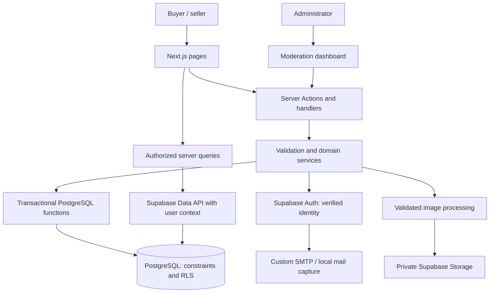
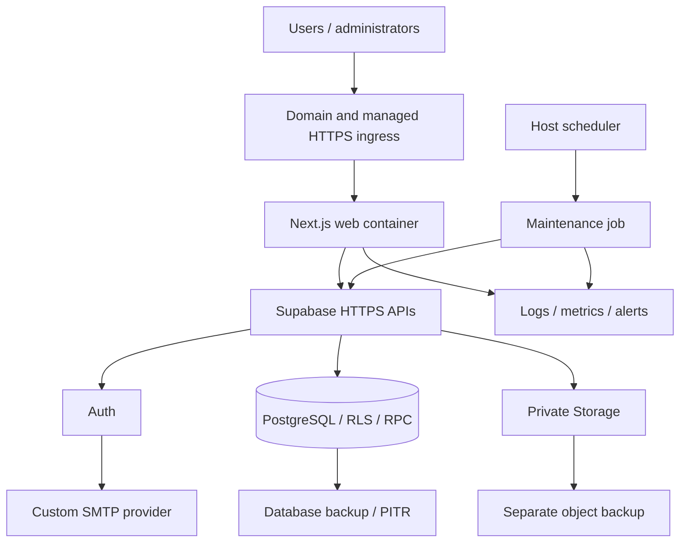

# AutoLinkX

AutoLinkX is a planned car marketplace where sellers list vehicles, buyers discover cars and contact sellers, and administrators moderate listings. One account can both buy and sell.

Read the [MVP product document](MVP.md) for the first-release scope, user journeys, milestones, and acceptance criteria. This README provides the supporting technical and deployment plan.

Use the [two-developer TODO board](TODO.md) for task ownership, file boundaries, dependencies, and integration checkpoints.

Your backend/platform work is expanded in the [Developer A detailed checklist](TODO-DEVELOPER-A.md).

Coding assistants should read [AGENTS.md](AGENTS.md) for repository-wide architecture, ownership, security, and verification rules.

## Current status

**MVP documentation; application not implemented.** The initial inspection found no existing Django application or `AGENTS.md`. Preliminary package, Next.js, TypeScript, environment, and Supabase configuration files were created before the task was clarified as documentation. They are unverified scaffolding, not a runnable MVP; there are no implemented pages, migrations, or tests. No application tests or deployments have been performed.

The agreed stack is **Next.js + Supabase**. Next.js provides the website and business workflows; Supabase provides Auth, PostgreSQL, and Storage. We will build a custom moderation dashboard.

This replaces the earlier Better Auth, ORM, and dual-database proposal. **Use local Supabase/PostgreSQL instead of SQLite**, keeping database functions and access policies consistent across environments. Django, NestJS, a separate REST backend, and an ORM are not required.

### Implemented

- Repository initialized.
- Product, architecture, infrastructure, and implementation plan documented.

### Planned first release

- Registration, login, logout, email confirmation, password recovery, and profile editing.
- Seller listing creation/editing, ordered photos, cover selection, submission, archiving, and sold status.
- Published vehicle search, filters, sorting, pagination, and details.
- Favorites, buyer inquiries, seller inbox, and listing reports.
- Administrator approval/rejection with reasons, report resolution, and audit history.
- Responsive, accessible pages with loading, validation, empty, error, and success states.

Payments, financing, real-time chat, reviews, AI features, and Supabase Realtime are outside this release. Provisioning hosted resources and deploying are separate tasks.

## Application architecture

Use one Next.js App Router application. Server Components render pages; Server Actions handle ordinary forms; Route Handlers handle authentication callbacks and bounded image upload/delivery. Client Components are limited to gallery controls, upload previews, and form interaction.



| Concern | Planned approach |
| --- | --- |
| Runtime | Supported Node.js LTS; pin compatible Node.js, Next.js, and package versions during foundation |
| UI | Next.js App Router, React, TypeScript, shared CSS tokens and accessible components |
| Authentication | Supabase Auth email/password with `@supabase/ssr` |
| Data access | `@supabase/supabase-js`, generated database types, SQL RPC functions for transactions |
| Database | PostgreSQL through local Supabase and separate hosted staging/production projects |
| Authorization | Server checks plus row-level security (RLS), grants, and controlled mutation functions |
| Images | Sharp decoding/normalization and private Supabase Storage |
| Migrations | Versioned SQL in `supabase/migrations/`; Supabase CLI as the single migration tool |
| Tests | Vitest, database/RLS integration tests, and Playwright |
| Web hosting | Managed container host with HTTPS ingress; provider chosen before deployment |

Keep accounts, listings, interactions, moderation, and infrastructure as folders inside one application. Pages/actions parse requests and call services. TypeScript services validate inputs; database functions own atomic mutations and security invariants. Several independent Supabase API requests are not a database transaction.

## Authentication and security boundaries

Use request-scoped server clients carrying the user's session. Follow Supabase's SSR cookie and token-refresh integration for the pinned Next.js release. Verify identity using the supported verified-claims/user APIs; do not trust an unverified cookie or `getSession()` result. Restrict confirmation/recovery redirects to allowed application destinations. See [Supabase SSR guidance](https://supabase.com/docs/guides/auth/server-side/creating-a-client).

Use the library's supported cookie behavior: Supabase browser/SSR flows must not be described as a custom system with exclusively HTTP-only cookies. Apply HTTPS, appropriate cookie settings, origin/CSRF checks, content security policy, and output escaping. Test password-reset session revocation and document the residual validity of already issued access tokens.

Every Server Action and handler must authorize independently. Hidden buttons and layout guards are insufficient. See [Next.js authentication guidance](https://nextjs.org/docs/app/guides/authentication).

### RLS and direct API protection

Supabase APIs can be called outside Next.js. Access must remain safe when a caller uses the publishable project key and their own token directly.

| Resource | Read access | Mutation rules |
| --- | --- | --- |
| Listings | Published publicly; own rows for sellers; all for administrators | Controlled functions enforce owner, version, role, and transition |
| Public profile | Display name/location and explicitly published contact values | Owner updates through a function without role-changing access |
| Private contact | Owner only | Owner-scoped validated updates |
| Favorites | Their owner | Idempotent add/remove; unique user/listing pair |
| Inquiries | Buyer and listing owner | Creation checks availability and limits atomically; seller can mark read |
| Reports | Reporter-safe projection; full record for administrators | Controlled create/resolve; internal resolution notes excluded from reporter data |
| Audit history | Owner-safe decision history; full administrator history | Append only through lifecycle functions |
| Administrator membership | Restricted membership lookup | Operator-only bootstrap; never editable through profiles |
| Storage objects | Controlled media delivery | Validated server upload; no unrestricted direct object writes |

Enable RLS on exposed tables and minimum grants. RLS protects rows, not columns: keep private contacts and internal fields in separate tables/projections. Put administrator membership and rate-limit internals in a non-exposed schema where practical.

Revoke direct listing/photo writes from browser roles. Expose narrow RPC commands such as `save_listing`, `submit_listing`, `mark_sold`, `moderate_listing`, and `create_inquiry`. Functions must derive the actor from `auth.uid()`, reject missing identity, check database administrator membership, and enforce expected versions. Never authorize administrators through editable user metadata.

Where security-definer functions are necessary, fix the search path, qualify objects, restrict EXECUTE grants, and explicitly check every target and permission. Review their RLS-bypass behavior. Policies and grants must prevent callers from bypassing these functions.

Routine requests use the publishable key plus user identity. Isolate secret/service-role clients in a server-only module for Auth administration, validated Storage writes, and maintenance. These credentials bypass RLS: never expose them in browser bundles, general query helpers, or logs. Privileged functions independently establish the authorized owner and target.

## Data model

| Entity | Main fields and constraints |
| --- | --- |
| `auth.users` | Supabase-managed identity; no duplicate password/session implementation |
| `profiles` | User ID, display name, location, separately opted-in public contact values |
| Private contact record | User ID, private phone/email, publication preferences |
| Administrator membership | Unique user ID, grant actor/time; no client write access |
| `listings` | Seller, make/model, year, price in integer minor units, currency, mileage in km, transmission, fuel, location, condition, description, status, version, timestamps |
| `listing_photos` | Listing, random storage key, display order, dimensions, cover flag |
| `favorites` | User/listing pair with unique constraint, created time |
| `inquiries` | Buyer, listing, bounded message, created time, seller-read time |
| `reports` | Reporter, listing, category, explanation, open/resolved/dismissed status, resolution note, resolver, timestamps |
| `listing_events` | Listing, actor, previous/new status, reason, version, timestamp; append-only |
| Rate-limit buckets | Action, actor or hashed trusted IP key, window/count, expiry |
| Upload staging | Owner, object key, validation/attachment state, expiry |

Use foreign keys, numeric/status checks, one-cover-per-listing uniqueness, and one-open-report-per-reporter/listing uniqueness. Index publication time, seller/status, inbox relationships, and common filters. Use one configured marketplace currency. Profile initialization must tolerate partial onboarding and retries.

## Listing lifecycle

New listings start as `draft`; derive the owner from verified identity.

| From | To | Actor and condition |
| --- | --- | --- |
| draft | pending_review | Owner submits complete valid details and at least one validated photo |
| rejected | pending_review | Owner corrects and resubmits |
| pending_review | published | Administrator approves another user's listing |
| pending_review | rejected | Administrator rejects another user's listing with a reason |
| pending_review | draft | Owner withdraws or edits substantive details |
| published | pending_review | Owner saves valid substantive changes; immediately removed from public discovery |
| published | sold | Owner marks sold |
| published | rejected | Administrator removes another user's violating listing with a reason |
| draft, pending_review, published, rejected, sold | archived | Owner archives |
| archived | draft | Owner restores for editing and fresh review |

Deny every other transition. Sold cars must be archived/restored before resubmission. Administrators cannot moderate their own listings. Draft/rejected edits retain their status until submission.

Substantive changes include specifications, price, location, description, photos, display order, and cover selection. Save changes, status, version, and audit events atomically. Invalid edits leave the previous listing intact. Use expected versions and row locks to reject stale edits/decisions.

Inquiry creation must lock/check the same listing row as lifecycle commands, require published status, enforce limits, and insert in one transaction. A concurrent sale and inquiry are ordered by these transactions. RLS is an access boundary, not the state machine.

Only published cars appear in public homepage, search, and details. Owners/administrators use protected previews for other states. Read availability from current database state; do not shared-cache private pages.

## Pages and buyer experience

| Route | Purpose |
| --- | --- |
| `/` | Homepage, search entry, latest published cars |
| `/cars` | Search/filter/sort/pagination |
| `/cars/[id]` | Published details, photos, seller projection, inquiry/report |
| `/register`, `/login` | Account entry |
| `/forgot-password`, `/reset-password`, `/auth/confirm` | Recovery and confirmation |
| `/profile`, `/favorites` | Profile/contact controls and saved cars |
| `/dashboard` | Seller inventory and inquiry summary |
| `/dashboard/listings/new` | Draft creation |
| `/dashboard/listings/[id]` | Private preview and rejection feedback |
| `/dashboard/listings/[id]/edit` | Owner editing, photos, lifecycle actions |
| `/dashboard/inquiries` | Seller's received inquiries |
| `/admin/listings`, `/admin/reports` | Review and report queues |

Search parameters live in the URL: keyword, make/model, year/price ranges, mileage ceiling, transmission, fuel, condition, and location. Use parameterized PostgreSQL queries/RPC with bounded inputs, case-insensitive matching, and escaped wildcard handling. Never concatenate raw user text into SQL or Supabase filter expressions.

Whitelist newest, price ascending/descending, year descending, and mileage ascending sorts. Use stable ID tie-breakers, 12 results per page, validated ranges, and preserved filters. No external search engine is needed initially.

Share navigation, cards, buttons, typography, fields, and status badges. Include visible labels, keyboard focus, inline errors and summaries, useful empty states, pending feedback, responsive galleries, and clear archive/sold confirmations. Prevent duplicate mutations on the server.

## Validation, images, privacy, and spam

- Validate required fields at submission: reasonable year range, positive price, nonnegative mileage, known enum values, and bounded text.
- Allow 10 photos per listing, 5 MB each, with a decoded pixel limit. Decode actual JPEG/PNG/WebP bytes, normalize with Sharp, strip metadata, and reject corrupt files/SVG. Use random object names.
- Upload through a bounded Node.js handler. Check ownership, validate bytes, stage a private object, then attach metadata with an authorized database command. Storage and database writes are not one transaction: use staging records, retry-safe attachment, and delayed orphan cleanup. Keep the prior image until replacement succeeds.
- Deny public bucket access and unrestricted browser uploads. Initial media delivery checks current publication or owner/admin access in Next.js, then streams through an isolated Storage client. Use private/no-store responses and bypass shared image optimization. Avoid long-lived signed URLs, which remain usable until expiry after a status change. Previously downloaded images cannot be recalled.
- Public profiles include only explicitly opted-in contact values. Private email, phone, message bodies, and internal notes must not leak through HTML, props, or API projections.
- Require sign-in for favorites; require confirmed, signed-in accounts for inquiries/reports. Block self-inquiries and unavailable-listing inquiries.
- Add honeypots, length limits, duplicates checks, and database-enforced account limits: initially 5 inquiries/hour and 1 per listing/10 minutes; 5 reports/day and one open report per listing.
- Account limits belong inside RPC functions so direct API calls cannot bypass them. Add separate trusted-IP limits at Next.js ingress/actions; never trust an IP argument supplied by an RPC caller. Configure Supabase Auth throttling because Next.js limits do not cover direct Auth calls.
- Configure production SMTP, confirmation/reset templates, allowed redirects, and generic recovery responses. Never log credentials, cookies, reset links, contact details, or inquiry bodies.

## Infrastructure and deployment

Start with one Next.js container on a managed host and a hosted Supabase project. Use a separate hosted project for staging and locate web hosting near the Supabase region. Supabase does not host the Next.js application in this plan.



| Environment | Application | Backend | Email |
| --- | --- | --- | --- |
| Local | Native `npm run dev` | CLI-managed local Supabase in Docker | Local mail capture |
| CI | Disposable build/test processes | Disposable local Supabase | Local/fake mail |
| Staging | Production-format container/HTTPS | Separate hosted Supabase project | Restricted test recipients |
| Production | Approved container/HTTPS | Hosted production Supabase project | Verified custom SMTP sender |

Isolate credentials, users, and storage between environments. Preview deployments must not use production data. Never expose local Studio publicly or treat the CLI development stack as production hosting.

### Runtime and configuration

- Build a pinned multi-stage, non-root Docker image with Next.js standalone output and copied static assets. Use resource limits, graceful shutdown, and readiness-based routing. The web filesystem is disposable.
- Managed ingress provides TLS, request/upload limits, and trusted-proxy configuration. Normal application traffic uses HTTPS Supabase APIs with user context; direct PostgreSQL credentials are limited to migration/maintenance jobs that need them.
- Provide non-sensitive liveness/readiness endpoints. Monitor database/Auth/Storage separately and do not restart healthy processes solely for SMTP outages.
- Package admin/migration/cleanup tools explicitly; standalone web output may omit their dependencies. Run short-lived scheduled cleanup jobs with leases and retry-safe batches. No permanent worker or queue is required initially.
- Store privileged keys in host/CI secrets. Configure hosted Auth SMTP and redirects in Supabase; they are not automatically configured by Next.js environment variables.
- Prefer server-only runtime Supabase URL/publishable-key configuration initially so an image can be promoted across environments. If browser clients become necessary, explicitly inject public runtime configuration or build environment-specific artifacts; `NEXT_PUBLIC_` values are build-time values.
- Before adding replicas, use identical images, coordinate Server Action encryption keys/deployment IDs, and test old browser submissions. Add shared caches only with coordinated invalidation. See [Next.js self-hosting guidance](https://nextjs.org/docs/app/guides/self-hosting).

### CI/CD and release sequence

1. **Pull request:** install locked dependencies, lint/typecheck, start disposable Supabase, apply migrations, validate generated types, run unit/RLS/integration/browser tests, and build. Test anonymous, seller A, seller B, and administrator access through direct APIs. Untrusted PRs receive no hosted secrets.
2. **Artifact:** build and scan an immutable image tagged by commit, publish to a registry, and record its digest. Embed no privileged project credentials.
3. **Staging schema/config:** explicitly select staging, review pending SQL, and run migrations once. Reconcile private buckets, Auth redirects/templates, and SMTP separately; migrations do not capture all hosted settings.
4. **Staging rollout:** deploy, wait for readiness, and test accounts, recovery, uploads, approval, search, inquiry, sold visibility, reports, and direct API restrictions.
5. **Production gate:** review staging results, exact target project, migration compatibility, backup health, and previous image. Actual deployment requires a separate authorized release task.
6. **Release:** apply additive migrations under a deployment lock, reconcile configuration, deploy the tested image, switch traffic, and drain the previous instance. Do not migrate from every replica or seed production during releases.
7. **Verify:** inspect access controls, redirects, storage, errors, and latency. Record image/schema versions and outcome. Use a controlled account for any production mutation.

Keep tables, constraints, SQL functions, grants, RLS, and indexes in versioned migrations. Capture reviewed emergency Dashboard changes back into source. Test fresh setup and upgrades. Use additive changes and backfills, removing old fields only after the rollback window. See [Supabase migration guidance](https://supabase.com/docs/guides/local-development/database-migrations).

### Backups, rollback, and operations

Keep the previous web image available and maintain compatible RPC signatures/schema during rollout. Roll back the image only when compatible. Do not automatically reverse migrations or access-control fixes; prefer a forward fix when reversal would lose data or reopen access.

Select backup retention/PITR based on the chosen Supabase plan. Initial recovery targets are 1 hour RPO and 4 hours RTO, subject to cost and restore testing. **Database backups do not contain Storage object bytes.** Schedule separate recoverable object backups with manifests and retention aligned to database history. See [Supabase backup limitations](https://supabase.com/docs/guides/platform/backups).

Rehearse database, Auth-related state, object, and configuration restoration into an isolated environment before launch. Verify photo references, user access, grants, and RLS before switching traffic. Align delayed deletion with backup retention and monitor backup failures.

Capture request/release IDs, timings, and redacted error categories. Alert on sustained 5xx errors, API/database failures, reset delivery errors, failed uploads, cleanup failures, and backup failures. Monitor database/storage/egress quotas and host resources before scaling.

Before deployment, provide the domain, container host/region, registry, separate Supabase projects, private buckets/policies, keys, redirect allowlists, SMTP sender/domain, backup destination, and alert recipients. No resources are provisioned by this plan.

## Staged implementation plan

Each stage ends with a working, tested behavior and a reviewable change.

### 1. Foundation and security

- [ ] Scaffold Next.js/TypeScript; pin runtime, Supabase CLI, packages, and lockfile.
- [ ] Add local Supabase config, initial migrations, generated types, and validated environment settings.
- [ ] Implement SSR authentication, email confirmation/recovery, profiles, and protected administrator membership.
- [ ] Add RLS/grants and direct API tests before exposing tables.
- [ ] Build shared layout, accessible forms/error states, test scripts, and CI skeleton.

**Acceptance:** a user registers, confirms, signs in, recovers their password through local mail, and edits their own profile without accessing another user's private details or granting themselves administrator access.

### 2. Seller workflow

- [ ] Add listings, photos, audits, constraints, and transactional lifecycle functions.
- [ ] Implement owner create/edit/preview, photo ordering/cover, submission/archive/restore/sold actions.
- [ ] Add validated staged uploads and cleanup; prevent direct API bypasses.
- [ ] Build dashboard, filters, rejection feedback, and empty states.
- [ ] Test ownership, every transition, stale edits, malformed uploads, and atomic published edits.

**Acceptance:** sellers manage only their cars and cannot publish directly; substantive published edits remove availability until reviewed.

### 3. Buyer discovery

- [ ] Build homepage, search, details, public seller projections, and gallery.
- [ ] Implement bounded query filters, whitelisted sorting, stable pagination, and URL state.
- [ ] Test public and media visibility for every status through Next.js and direct Supabase access.
- [ ] Inspect mobile/desktop layouts and loading/error/empty states.

**Acceptance:** visitors see only published cars and opted-in contacts; private data never enters public responses.

### 4. Interactions

- [ ] Implement unique favorites and saved listings.
- [ ] Add atomic inquiry checks, seller inbox, reports, and account rate limits.
- [ ] Add trusted-IP limits, honeypots, duplicate handling, and feedback.
- [ ] Test direct RPC bypass attempts, self-inquiries, availability races, favorites concurrency, and inbox isolation.

**Acceptance:** buyers can save and inquire about available cars; sellers see only their inquiries; duplicates and races preserve constraints.

### 5. Moderation and release readiness

- [ ] Build approval/rejection queues, report resolution, reasons, and history.
- [ ] Test self-moderation denial, role changes, stale versions, and escalation attempts.
- [ ] Add safe local seed/admin scripts, container/tools targets, deployment templates, and runbooks.
- [ ] Run full checks, fresh/upgrade migrations, production build, and browser inspection.
- [ ] Replace planned setup commands with verified instructions and document outstanding configuration.

**Acceptance:** a seller submits, another administrator approves, a buyer discovers/inquires, the seller receives the inquiry and marks sold, and new inquiries fail. Reports are resolved with an audit trail. Actual deployment remains a separate task.

## Verification plan

Use unit tests for validation, database tests for transactions/constraints/RLS/grants, and browser tests for full workflows. Service-role-only tests do not demonstrate user permissions.

Cover ownership, all transitions, moderation, visibility, private contacts, duplicate favorites, inquiry availability/concurrency, report limits, search/filter/pagination, upload validation, recovery redirects, and sessions.

Planned scripts: `npm run lint`, `npm run typecheck`, `npm test`, `npm run test:db`, `npm run test:e2e`, and `npm run build`. CI recreates only disposable local databases, checks generated types, and tests upgrade migrations.

**Checks performed:** documentation/repository inspection only. Application scripts, migrations, builds, and browser checks are not available yet.

## Local setup plan (not executable yet)

Prerequisites: pinned supported Node.js, npm, Git, and a Docker-compatible runtime. The foundation stage adds project-local Supabase CLI/configuration. Local Supabase supplies PostgreSQL, Auth, and Storage; see [local development documentation](https://supabase.com/docs/guides/local-development).

Use the actual repository with an explicit destination matching this workspace:

```sh
git clone https://github.com/komradkat/AutoLinkx-v1.git Autolink
cd Autolink
```

Target workflow after implementation:

```sh
npm ci
npx supabase start
# Copy .env.example to .env.local and fill in local Supabase values.
npm run db:migrate:local
npm run db:types
npm run admin:create:local
npm run db:seed:local
npm run dev
```

The local migration wrapper must preserve data and explicitly target local Supabase. Database resets are reserved for disposable tests or explicitly requested local resets, never routine startup. Remote migration scripts must have separate names and explicit project targets.

Planned environment placeholders: `APP_URL`, `SUPABASE_URL`, `SUPABASE_PUBLISHABLE_KEY`, server-only `SUPABASE_SECRET_KEY`, bucket name, currency, and log level. Release jobs separately receive project reference, CLI credentials, and migration credentials. Do not commit or print keys; only publishable configuration may reach the browser.

Sample data needs migrated local Auth/Storage and private buckets. A repeatable script creates fictional accounts through the Auth admin API, placeholder photos, and varied listing statuses. It refuses non-local endpoints by default and does not overwrite real accounts/data. Administrator creation uses explicit secure input and no fixed shipped password. Hosted SMTP and project configuration are not supplied by local seed data.

## Planned source tree

The MVP document and this README define the plan; preliminary configuration files are unverified scaffolding. The target tree excludes generated output, dependencies, local databases, and uploaded files.

```text
Autolink/
  README.md
  MVP.md
  package.json
  package-lock.json
  .env.example
  next.config.ts
  Dockerfile
  .dockerignore
  .github/workflows/       # Checks and gated releases
  src/
    app/                  # Pages, actions, auth and media handlers
    components/           # Shared accessible UI
    features/
      accounts/
      listings/
      interactions/
      moderation/
    server/
      supabase/           # Request client; isolated privileged client
      auth/               # Verified identity and permission helpers
      storage/            # Validation, staging, attachment, delivery
      config/
      security/
  supabase/
    config.toml           # Local services, Auth, Storage configuration
    migrations/           # Tables, functions, grants, RLS, indexes
    tests/                # Database permissions and transaction tests
  scripts/                # Types, migrations, local seed/admin, cleanup
  tests/                  # Unit, integration, browser tests
  infra/                  # Hosting/release templates
  docs/runbooks/          # Deploy, rollback, backup, restore, incidents
  public/                 # Static branding; no vehicle uploads
```

## Remaining decisions and limitations

Choose the host/region, Supabase plan, SMTP provider, backup retention/destination, and marketplace currency before launch. Validate cost, limits, and recovery targets against those choices. Pin supported runtime/package versions when installing; none are currently installed by this project.

Local development now requires Docker/PostgreSQL instead of SQLite. Supabase reduces separately operated services but introduces dependencies on its Auth/Storage APIs and RLS model. Keep those explicit through isolated clients, versioned SQL, and tested recovery procedures. The Supabase Dashboard is an infrastructure tool, not the marketplace moderation interface.
